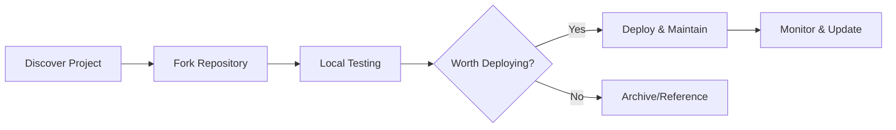

# 👋 Welcome to My Deployment & Backup Hub

<div align="center">
  
</div>

---

## 📌 What This Account Does

This is a **specialized deployment & archival account** dedicated to:

### 🎯 Core Missions

**1. ☁️ Cloud Deployment Hub**
- Forked projects optimized for one-click deployment on Vercel, Netlify, and other platforms
- Keep my main GitHub account clean and uncluttered from deployment forks
- Quick prototyping and production-ready deployments
- CI/CD pipelines pre-configured and battle-tested

**2. 💾 Backup & Archive Repository**
- Safeguard against force majeure scenarios (original authors deleting repositories)
- Preserve important open-source projects and tools
- Prevent knowledge loss when upstream repositories disappear
- Serve as an emergency fallback source

### 🏗️ Why Separate?

```
Main Account (@main)        Deployment Account (lovingfish)
├── Original Projects       ├── Forked Projects
├── Portfolio               ├── Verified Deployments
├── Production Work         ├── Quick-Deploy Forks
└── Clean, Curated          └── Backup Archives
```

**Benefits:**
- ✅ Main profile stays pristine and focused
- ✅ Easy one-click deployments without clutter
- ✅ Automatic backups of trusted open-source projects
- ✅ Disaster recovery for critical dependencies
- ✅ Speed: No need to search through main account

<br/>

---

## 🛠️ Supported Deployment Platforms

<div align="center">


</div>

<br/>

---

## 📊 Repository Categories

<div align="center">

| 📁 Category | Purpose | Status |
|-------------|---------|--------|
| 🚀 **Deployable** | Production-ready forked apps | Active |
| 💾 **Archives** | Backup of critical projects | Preserved |
| 🔧 **Tools** | Utility forks & helpers | Ready |
| 🧪 **Experiments** | Testing & prototyping | Sandbox |
| 📚 **References** | Learn & build upon | Active |

</div>

<br/>

---

## 🍴 Fork Analysis & Active Projects

### 🌟 Most Active Forks
Projects I actively maintain and deploy:

| Repository | Description | Tech Stack | Status |
|-----------|-------------|------------|---------|
| 🔗 [Project Name](link) | Brief description of what this fork is used for |  | 🟢 Active |
| 🔗 [Project Name](link) | Brief description |  | 🟢 Active |

### 🔨 Development & Testing Forks
Forks used for learning and experimentation:

- **[Repository Name](link)** - Learning purpose or experiment description
- **[Repository Name](link)** - Testing specific features or integrations

### 📦 Deployed Applications
Live deployments from forked repositories:

- 🌐 **[App Name](deployment-link)** - Deployed from [original-repo](link)
- 🌐 **[App Name](deployment-link)** - Deployed from [original-repo](link)

<br/>

---

## 🎯 How This Works

### Fork Decision Flow (Mermaid Diagram)



### Deployment Flow

```
┌──────────────────────────────────────────────┐
│  Discover Great Open-Source Project          │
└────────────────┬─────────────────────────────┘
                 │
                 ▼
┌──────────────────────────────────────────────┐
│  Fork to Deployment Account (lovingfish)     │
└────────────────┬─────────────────────────────┘
                 │
                 ▼
┌──────────────────────────────────────────────┐
│  Configure for Cloud Deployment              │
│  • Vercel config ✓                           │
│  • Environment variables ✓                   │
│  • Build settings ✓                          │
└────────────────┬─────────────────────────────┘
                 │
                 ▼
┌──────────────────────────────────────────────┐
│  One-Click Deploy to Production              │
│  └─ Vercel / Netlify / Docker               │
└──────────────────────────────────────────────┘
```

### Backup Flow

```
┌──────────────────────────────────────────────┐
│  Critical Project Identified                 │
└────────────────┬─────────────────────────────┘
                 │
                 ▼
┌──────────────────────────────────────────────┐
│  Fork & Archive to lovingfish Account        │
│  • Full history preserved                    │
│  • Original author credited                  │
│  • Source tracking maintained               │
└────────────────┬─────────────────────────────┘
                 │
                 ▼
┌──────────────────────────────────────────────┐
│  Protected Against Deletion                  │
│  ✓ Backup available if upstream disappears  │
│  ✓ Community can restore from archive       │
└──────────────────────────────────────────────┘
```

<br/>

---

## ⚡ Key Features

<div align="center">

| Feature | Benefit |
|---------|---------|
| 🔐 **Secure Backups** | Never lose access to critical open-source projects |
| 🚀 **Quick Deploy** | One-click deployment without main account clutter |
| 📚 **Preserved History** | Full git history maintained for all forks |
| 🎯 **Organized** | Clear categorization & easy discovery |
| 🔄 **Sync Ready** | Auto-sync available for active projects |
| 🛡️ **Disaster Recovery** | Emergency fallback when upstream fails |

</div>

<br/>

---

## 🌟 Best Practices

✅ **Backup Important Projects**
- Open-source libraries you depend on
- Critical tools and utilities
- Learning resources and examples

✅ **Deploy Wisely**
- Test before production deployment
- Configure environment-specific settings
- Monitor deployed instances

✅ **Respect Original Authors**
- Keep attribution clear
- Link to upstream repositories
- Credit contributors in documentation

✅ **Maintain Organization**
- Use consistent naming conventions
- Add descriptive README to each fork
- Document deployment requirements

<br/>

---

## 📈 Account Stats

<div align="center">


```text
🍴 Total Forks:        [Your Count]
🚀 Active Deployments: [Your Count]  
⭐ Stars Received:     [Your Count]
🔄 Regular Updates:    [Your Count]
```

</div>

<br/>

---

## 🔗 Repository Upstream Links

Each fork includes:
- 🔗 Link to original repository
- 📝 Original author & license information
- 🔄 Sync status with upstream
- 📦 Deployment configuration

<br/>

---

## 💡 Philosophy

> **Preserve. Deploy. Protect.** 
> 
> This account exists to backup critical open-source projects, enable seamless cloud deployments, and maintain a clean separation between production work and experimental forks.

<br/>

---

## 🤝 Contributing

Found an issue with a forked project?
1. Report it upstream first (original repository)
2. If upstream is unresponsive, we can help maintain the fork

<br/>

---

## 📞 Connect

<div align="center">

[](https://github.com/lovingfish)
[](https://github.com/lovingfish)

</div>

<br/>

---

<div align="center">

### 🛡️ Guarding Against Digital Loss 🛡️

*This account serves as a digital guardian—ensuring that brilliant open-source projects are never lost to time or circumstance, while keeping deployments swift and clean.*

**Built with ❤️ | Maintained with 🔒 | Deployed with ⚡**

</div>

---

**Account Type:** Deployment & Backup Hub | **Status:** Active | **Last Updated:** 2024
